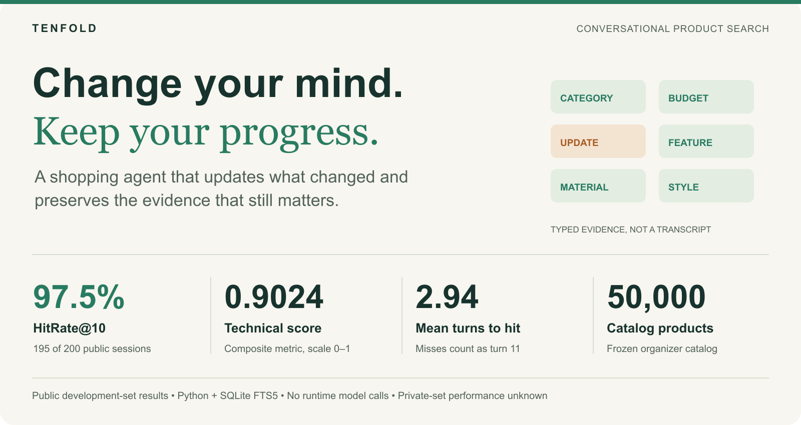
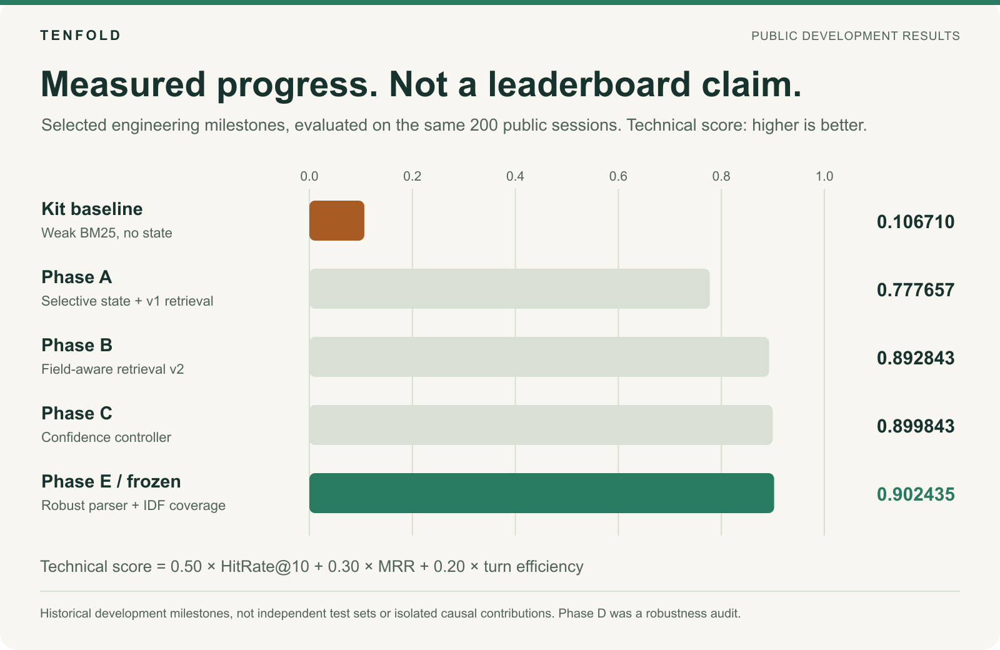
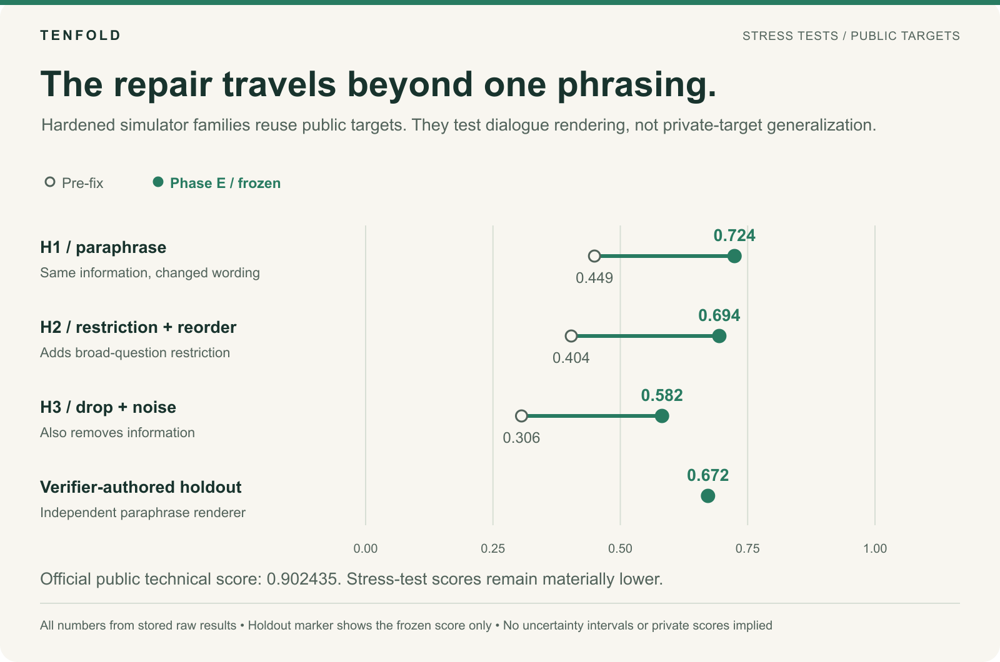
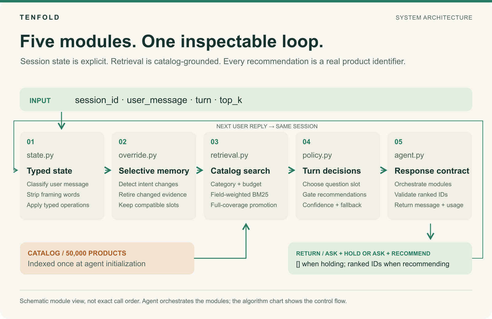
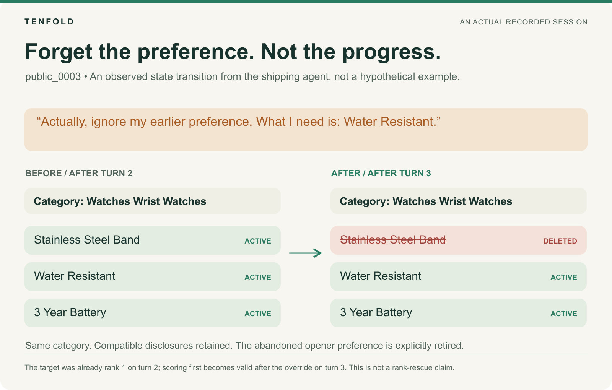
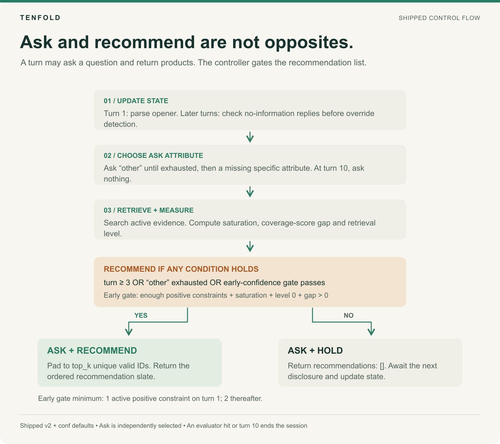
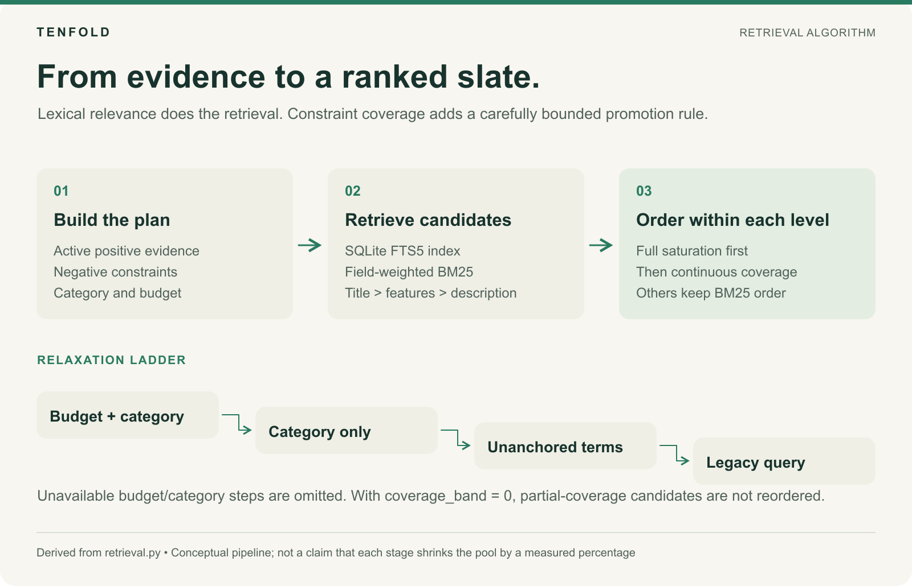
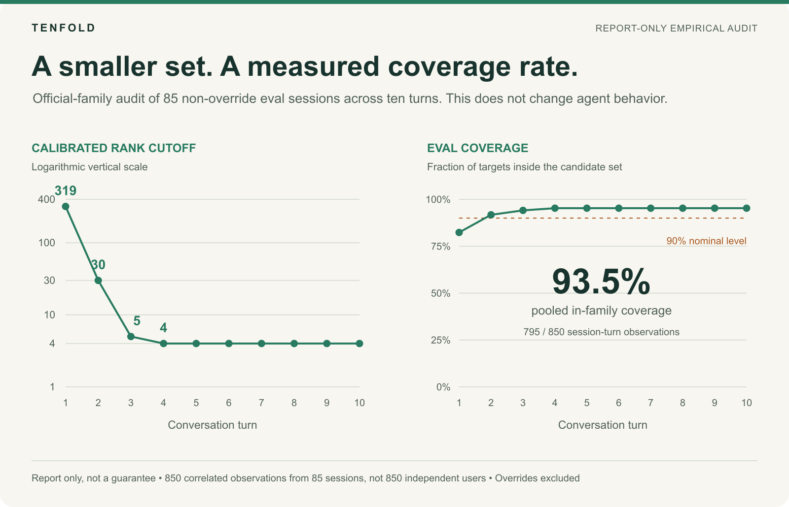
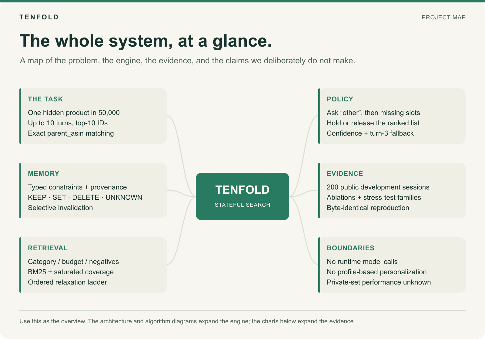

<picture>
  <source media="(prefers-color-scheme: dark)" srcset="assets/readme/01-overview-dark.png">
  <source media="(prefers-color-scheme: light)" srcset="assets/readme/01-overview-light.png">
  
</picture>

# TENFOLD

**A conversational shopping agent that treats a dialogue as a measurement problem.**
TikTok TechJam 2026 · Track 4 · Shopping Copilot

A shopper says what they want, changes their mind halfway through, and expects the
assistant to keep up. TENFOLD handles that by refusing to guess. Every user turn is
compiled into typed constraints, an intent reversal deletes only the belief that was
abandoned, and the agent recommends as soon as its own evidence says it has converged,
falling back to turn three if it has not. It is 2,600 lines of Python standard library over a 50,000-product
catalog: no network calls, no model calls, no external packages. The same command
produces the same output bytes every time.

## Watch it run

**[Watch the demo on YouTube](https://youtu.be/1jZBM5RIDK8)** · 2 min 58 s ·
the architecture, a real session, and the evaluation running end to end.
The same file is in this repository at
[`assets/TENFOLD-submission-2m58s.mp4`](assets/TENFOLD-submission-2m58s.mp4).

The session in the middle is a real one: `public_0003` from the public set, replayed from
its recorded run. The shopper asks for a stainless-steel-band watch and the agent surfaces
the right Casio at rank 1. Then they reverse: *"Actually, ignore my earlier preference.
What I need is: Water Resistant."* On screen, `Stainless Steel Band` is struck out and
marked deleted while `Water Resistant` and `3 Year Battery` stay live, and the same watch
returns at rank 1 on the turn the reversal lands. That session's stored row is in
[`results/e-fixed-official.json`](results/e-fixed-official.json), hit at rank 1 on turn 3.

## Results

Scored by the organizer's unmodified evaluator on the 200 public development sessions.
No private-set number appears anywhere in this repository.

| Metric | Kit baseline (weak BM25) | TENFOLD |
| --- | --- | --- |
| TechnicalScore | 0.10671 | **0.902435** |
| HitRate@10 | 0.125 | **0.975** (195 of 200 sessions) |
| MRR | 0.06803 | **0.845782** |
| Mean turns to conversion | 9.810 | **2.940** |
| Intent-override recovery | — | **29 of 30 sessions** |

TechnicalScore is the competition's composite of hit rate, reciprocal rank and
efficiency. It is not an accuracy percentage.

<picture>
  <source media="(prefers-color-scheme: dark)" srcset="assets/readme/07-public-progress-dark.png">
  <source media="(prefers-color-scheme: light)" srcset="assets/readme/07-public-progress-light.png">
  
</picture>

These are development milestones on the same public sessions, not a controlled ablation:
configurations differ between phases, and the public set is what we developed against.

## The part we are most proud of

A high score on a simulator that quotes constraint strings word for word can hide an
agent that has memorized phrasing. So we built our own harsher evaluators and pointed
them at ourselves.

<picture>
  <source media="(prefers-color-scheme: dark)" srcset="assets/readme/08-robustness-dark.png">
  <source media="(prefers-color-scheme: light)" srcset="assets/readme/08-robustness-light.png">
  
</picture>

H1 paraphrases every scripted sentence; H2 adds restricted questions and reordered
disclosure; H3 also drops evidence and adds noise. **The earlier version of our agent
collapsed to half its score under H1.** We traced that to a single component, an
exact-token coverage rerank fed by a template-bound parser, replaced it with
frame-agnostic parsing and IDF-weighted coverage, and retention went from 50% to 80%
while the official score *improved*. The last row is the honest one: a holdout evaluator
whose wording was written after the implementation was locked, by someone who had not
seen the parser. It scores 0.672183, against 0.363 for the pre-fix agent.

These renderers reuse public targets, and H2 and H3 also change what information is
available at all, so they are evidence about the system rather than a score forecast.

One honest postscript. We built this because the specification we had left the door open
("if natural-language paraphrasing is added by the organizer"), and an agent that memorises
phrasing would have been exposed. The organizer has since closed that door: the final
evaluation FAQ states that it uses the same deterministic customer-message templates and
that no undisclosed paraphrases are introduced. So this work did not turn out to be
insurance we needed for the score. We are keeping it in, and reporting it as what it is:
the reason we found and fixed a real defect in our own retrieval, and the evidence that
the agent's behaviour does not rest on matching fixed strings.

### A note on what this score is made of

A high score on this evaluator can be reached by inverting it. The simulator quotes each
product's own catalog strings word for word, and those strings are derived by a public
deterministic function, so all 50,000 of them can be precomputed offline and reverse
indexed. Recognising which row the evaluator drew from then replaces searching for it.

We tested what that costs. Rebuilding the inversion strategy and running it through the
same paraphrase tier as above, it retains **26%** of its score (0.708 to 0.182, hit rate
0.800 to 0.235). TENFOLD retains **80%** (0.902 to 0.724).

We measured it because we caught ourselves doing a weaker version of the same thing and
fixed it, which is the repair described above.

## Architecture

<picture>
  <source media="(prefers-color-scheme: dark)" srcset="assets/readme/02-architecture-dark.png">
  <source media="(prefers-color-scheme: light)" srcset="assets/readme/02-architecture-light.png">
  
</picture>

Five modules, each with a measured contribution on the official evaluator:

1. **`state.py` — typed dialogue state.** Every message is classified before it is
   trusted (disclosure, override, deflection, no-preference, nudge) and compiled into
   per-slot `KEEP` / `SET` / `DELETE` / `UNKNOWN` operations. Conversational filler is
   stripped before anything becomes a constraint.
2. **`override.py` — selective invalidation.** On a reversal, only the abandoned or
   contradicted constraint is deleted; the category anchor and every compatible
   constraint survive. Worth **+0.065 TS**, and it lifts override recovery from 0.333
   to 0.833 on its own.
3. **`retrieval.py` — conjunctive, field-aware retrieval.** Category and price become
   hard filters, negations become exclusions, and an IDF-weighted coverage rerank
   promotes only candidates that satisfy every active constraint, with a relaxation
   ladder so the pool never empties. Worth **+0.175 TS**, the largest single component.
4. **`policy.py` — the confidence controller.** Asking is cheap; a bad recommendation is
   not, because the session locks its rank at the first hit. The agent holds until its
   leading candidate saturates the evidence, then opens. A strict improvement: **+0.007
   TS with zero rank losses** and 66 sessions converging faster.
5. **`agent.py` — response orchestration.** Contract-conformant output every turn, exactly
   ten unique catalog-valid ASINs when recommending, and no exception ever escapes.

<picture>
  <source media="(prefers-color-scheme: dark)" srcset="assets/readme/06-selective-memory-dark.png">
  <source media="(prefers-color-scheme: light)" srcset="assets/readme/06-selective-memory-light.png">
  
</picture>

That is session `public_0003`, drawn from its stored run. Its target was already ranked
first on turn 2; the override is what makes the turn-3 hit scorable, so this shows memory
behaving correctly, not a rank being rescued.

## How a turn is decided

<picture>
  <source media="(prefers-color-scheme: dark)" srcset="assets/readme/03-algorithm-dark.png">
  <source media="(prefers-color-scheme: light)" srcset="assets/readme/03-algorithm-light.png">
  
</picture>

Every message follows the same path: update the typed state, choose which attribute to
ask about, retrieve and score, then decide whether to hold or recommend. The agent opens
recommendations when its leading candidate satisfies the evidence it has, when the
shopper has nothing further to add, or by turn three at the latest.

## Retrieval and ranking

<picture>
  <source media="(prefers-color-scheme: dark)" srcset="assets/readme/04-retrieval-dark.png">
  <source media="(prefers-color-scheme: light)" srcset="assets/readme/04-retrieval-light.png">
  
</picture>

Hard constraints become filters rather than search terms, so a category or a price
ceiling removes candidates instead of merely down-weighting them. Within what survives,
field-weighted BM25 over SQLite FTS5 does the ranking, and only candidates that satisfy
every active constraint may be promoted above it. A relaxation ladder widens the query
when a filter would otherwise empty the pool.

## Uncertainty audit

<picture>
  <source media="(prefers-color-scheme: dark)" srcset="assets/readme/09-uncertainty-audit-dark.png">
  <source media="(prefers-color-scheme: light)" srcset="assets/readme/09-uncertainty-audit-light.png">
  
</picture>

We calibrated how large a candidate set the agent's own ranking needs in order to contain
the right product 90% of the time, then measured it once on sessions held out from that
calibration. The set contracts from 319 candidates to 4 across the first four turns, and
pooled coverage over those sessions is 93.5%. Per turn it climbs as the evidence arrives:
82.4% at turn one, then 91.8%, 94.1%, and 95.3% from turn four on. Applying the
official cutoffs to the hardened families holds only 60-75%, which is exactly why
calibration has to be per-family.

This audit is report-only. It changed no shipped behavior, it is an empirical measurement
on this set rather than a guarantee, and its 850 session-turn observations are correlated
within sessions rather than 850 independent users. The left panel is a calibrated rank
cutoff, not a claim that 50,000 products were filtered to four.

## The project map

<picture>
  <source media="(prefers-color-scheme: dark)" srcset="assets/readme/05-mindmap-dark.png">
  <source media="(prefers-color-scheme: light)" srcset="assets/readme/05-mindmap-light.png">
  
</picture>

The whole system on one page: what the task is, how state and retrieval work, what the
policy decides, what evidence backs each claim, and where the boundaries are. The last
branch is the honest one: runtime search makes no model calls, and private-set behavior
and general language robustness remain unknown.

## How this was built

Every component in the list above landed with an ablation that measured it, and every
number in this README recomputes from raw per-session JSON in `results/`. Three habits
did most of the work:

- **One switch per idea.** Nothing is forked. Each component is an environment switch, so
  any historical configuration reproduces from today's code.
- **Thresholds fixed before the run.** The repair round declared its pass marks in advance
  (official ≥ 0.895, H1 ≥ 0.72) and reported against them rather than after them.
- **Adversaries we did not control.** The holdout renderer was authored after the code was
  frozen, by someone who had not read the parser. That is the number we trust most.

We also killed our own ideas when they failed. An adaptive stopping variant was measured
against a bar written down before it was built, missed it (+0.0198 against a +0.03
requirement, where even a perfect-foresight ceiling fell short), and was not shipped. The
audit above is what survived that process, in report-only form.

**[docs/VERIFICATION.md](docs/VERIFICATION.md)** has the reproduction steps, the checksums of the
shipped agent, the contract and determinism checks, and the full record of that rejected
variant with its analysis artifact.

## Setup and reproduction

Requirements: Python 3.10+ with sqlite3 FTS5 (standard on macOS and most Linux builds), git, gunzip. No pip installs.

1. Clone this repository, then clone the organizer kit into `kit/` (it is gitignored here and never modified):

```bash
git clone https://github.com/TechJam2026/techjam-conversational-search kit
```

2. Download `catalog.jsonl.gz` from the kit's participant-kit release into `kit/data/` and decompress it:

```bash
# download catalog.jsonl.gz from the participant-kit release of the repo above
mv ~/Downloads/catalog.jsonl.gz kit/data/
gunzip kit/data/catalog.jsonl.gz
```

3. Run the full official evaluation of the production agent from `run/` (an overlay of symlinks; the evaluator and data resolve into `kit/`, the agent into `agent/`):

```bash
cd run
TENFOLD_RETRIEVAL=v2 TENFOLD_OVERRIDE=selective TENFOLD_HOLD=conf \
TENFOLD_ASK=other_first TENFOLD_PARSE=robust TENFOLD_COVERAGE=idf \
python3 -m evaluator.local_evaluator --output /tmp/tenfold-official.json
cmp /tmp/tenfold-official.json ../results/e-fixed-official.json && echo BYTE-IDENTICAL
```

**No configuration is required.** The shipped defaults are the production configuration, so the bare command above is the canonical reproduction; the explicit switches are shown so the configuration is visible in the command and so historical ablations stay reproducible from the same code. Expected output: `recommended_technical_score` 0.902435 (TS 0.90243, HitRate@10 0.975, MRR 0.84578, MTTC 2.940), and the `cmp` line confirms the output is byte-identical to the stored result. The run takes under 15 seconds on a laptop.

## Reproducing every experiment headline

Each experiment's headline number reproduces through `experiments/run_arm.sh` (official evaluator) or `hardened/run_hardened.sh` (hardened tiers), driven entirely by environment switches; nothing is forked. `PHASE` and `ARM` only pick the output filename, which is how the stored files in `results/` are named. Arms recorded before the parser fix need `TENFOLD_PARSE=frame TENFOLD_COVERAGE=contain` set explicitly, because the shipped defaults are the production values.

```bash
# selective invalidation on v1 retrieval: TS 0.77766, override HR 0.833
PHASE=a ARM=override-selective TENFOLD_RETRIEVAL=v1 TENFOLD_OVERRIDE=selective \
TENFOLD_HOLD=hold2 TENFOLD_ASK=other_first TENFOLD_PARSE=frame TENFOLD_COVERAGE=contain \
experiments/run_arm.sh

# retrieval v2 at fixed hold2: TS 0.89284
PHASE=b ARM=v2-selective-hold2 TENFOLD_RETRIEVAL=v2 TENFOLD_OVERRIDE=selective \
TENFOLD_HOLD=hold2 TENFOLD_ASK=other_first TENFOLD_PARSE=frame TENFOLD_COVERAGE=contain \
experiments/run_arm.sh

# confidence controller: TS 0.89984, MTTC 3.015
PHASE=c ARM=conf TENFOLD_RETRIEVAL=v2 TENFOLD_OVERRIDE=selective \
TENFOLD_HOLD=conf TENFOLD_ASK=other_first TENFOLD_PARSE=frame TENFOLD_COVERAGE=contain \
experiments/run_arm.sh

# the earlier agent collapsing under paraphrase (H1): TS 0.44931
HARDENED_TIER=H1 PHASE=d ARM=headline-h1 TENFOLD_RETRIEVAL=v2 TENFOLD_OVERRIDE=selective \
TENFOLD_HOLD=conf TENFOLD_ASK=other_first TENFOLD_PARSE=frame TENFOLD_COVERAGE=contain \
hardened/run_hardened.sh

# the fixed production agent on the hardened tiers: H1 0.72428, H2 0.69437, H3 0.58189
for TIER in H1 H2 H3; do
  HARDENED_TIER=$TIER PHASE=e ARM=fixed-$(echo $TIER | tr 'A-Z' 'a-z') \
  TENFOLD_RETRIEVAL=v2 TENFOLD_OVERRIDE=selective TENFOLD_HOLD=conf \
  TENFOLD_ASK=other_first TENFOLD_PARSE=robust TENFOLD_COVERAGE=idf \
  hardened/run_hardened.sh
done

# unseen-paraphrase holdout: TS 0.67218
TENFOLD_RETRIEVAL=v2 TENFOLD_OVERRIDE=selective TENFOLD_HOLD=conf \
TENFOLD_ASK=other_first TENFOLD_PARSE=robust TENFOLD_COVERAGE=idf \
hardened/run_holdout.sh
```

Every stored arm in `results/` carries its full per-session raw output, so any number in `docs/RESULTS.md` can be recomputed from the JSONs alone (`experiments/summarize.py <result.json>`).

## Repository map

```
agent/            the agent itself, imported by the official harness as `starter`
                  agent.py · state.py · override.py · retrieval.py · policy.py
tests/            contract, determinism, effectiveness and consistency checks;
                  the effectiveness tests fail on an agent that returns nothing
run/              symlink overlay that lets the official harness import this agent
run_kit/          the same overlay pointed at the kit's own baseline agent
experiments/      the arm runner and summarize.py, which recomputes any stored result
results/          one evaluator output per experiment, every per-session row kept
hardened/         our own evaluator forks: paraphrase tiers H1-H3 and the holdout
audit/            the uncertainty audit and the rejected-variant analysis
assets/           the submission film and the figures above (light and dark, SVG and PNG)
docs/             RESULTS.md (full evidence), VERIFICATION.md (how to check it)
Makefile          make setup · make eval · make test · make verify
```

Three commands cover everything a reviewer needs:

```bash
make setup     # clone the organizer kit into kit/
make test      # contract, determinism and consistency checks
make eval      # the scored run, compared byte-for-byte against the stored result
```

## Resource disclosure

Required by the submission rules, and straightforward here because nothing leaves the
machine.

| | |
| --- | --- |
| Model calls at runtime | none |
| Token usage | 0 prompt, 0 completion, 0 total (reported by the evaluator over all 200 sessions) |
| Estimated model cost | $0.00 |
| Third-party dependencies | none; Python standard library and sqlite3 FTS5 only |
| Network access at runtime | none |
| Startup | about 1 second to build the FTS5 index over 50,000 products |
| Per-turn latency | about 5 ms median, 23 ms at the 95th percentile |
| Full 200-session evaluation | under 10 seconds wall clock on a laptop, about 48 ms per session |

There is no external API, no local model, and no vector database. Retrieval is BM25 over
SQLite's built-in full-text index, so the only cost is CPU time.

## Limitations and future work

- Five public-set sessions still miss: four have pure-boilerplate intent cards ("100% Cotton", "Imported") shared verbatim by dozens of in-class products, and one has a synthesized "color" constraint its own listing text lacks, so no ranking signal separates the target. These need a different information source, not a better ranker.
- The final evaluation uses the same message templates as the public set, per the organizer's final-evaluation FAQ, so the hardened and holdout numbers (80.3% and 74.5% retention) describe the system's behaviour rather than predicting its final score.
- The dialogue parser has real gaps outside those templates, which we measured rather than assumed. `not leather` is correctly stored as a negation, but `I want no leather` is stored as a positive preference, because framed messages take a path where negation parsing is disabled. A clause joined by "and" can be captured as one constraint instead of several. A restated value in the same slot is added alongside the earlier one rather than replacing it. None of these shapes occur in the official templates: across all 200 sessions the evaluator emits eight fixed message forms, and negation-shaped and conjunction-joined messages appear zero times. We measured what fixing them would do to the public score: the negation and conjunction fixes change nothing at all (zero sessions affected), and blanket same-slot superseding makes the score slightly *worse* (0.902435 to 0.902235), because two card strings in one session are complementary attributes of the same product rather than contradictions. They are on this list as genuine limits on the agent as a general shopping assistant, not as pending score work.
- The uncertainty audit's calibration is pooled rather than scenario-conditional, and override sessions sit outside its calibration population (covered 82.7% on official, reported descriptively).
- With more time: scenario-conditional calibration, tie-breaking signals for generic cards, and a calibrated treatment of the override population.

## Team

- **Ambar** ([@Ambar-13](https://github.com/Ambar-13)): system design and all of the
  machine learning work. Typed dialogue state, selective invalidation, the retrieval
  and ranking engine, the confidence controller, and the evaluation, robustness and
  verification harnesses.
- **Matthias Joseph**: repository and project structure, engineering review, and the
  submission materials. Shaped how the system is organised and how the work reads to
  someone encountering it for the first time.

## Data attribution

The catalog is the organizer kit's frozen Amazon Reviews 2023 subset (McAuley Lab, UCSD);
see `kit/DATA_ATTRIBUTION.md` after setup. The figures in this README are generated from
the stored result JSONs in `results/`; the underlying values are in
`assets/readme/chart-data.csv`.
